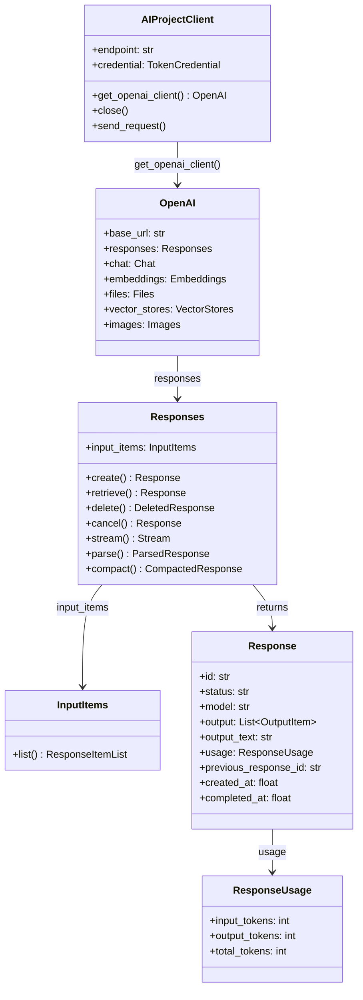
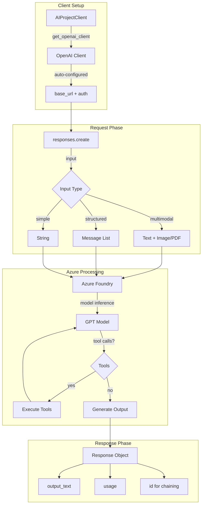
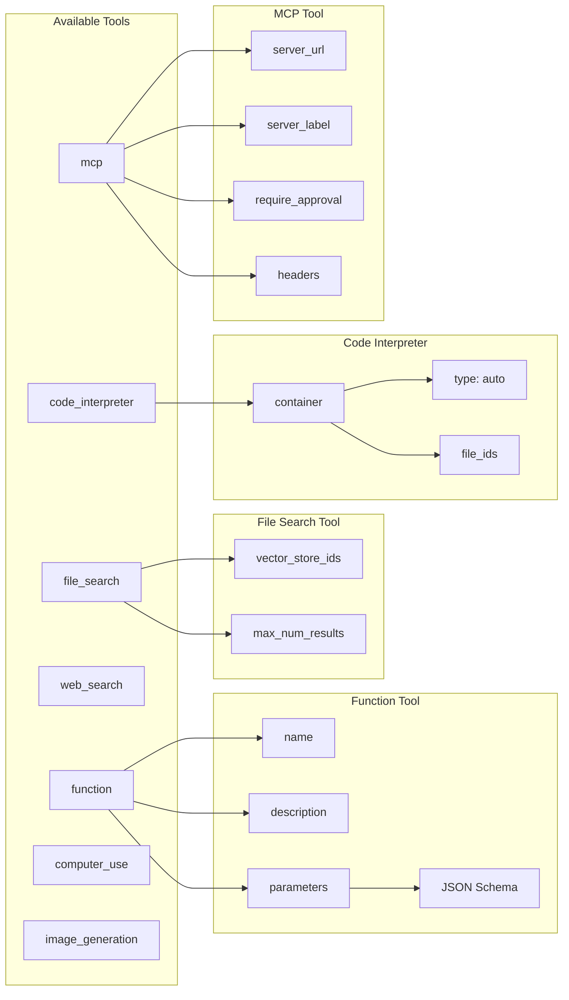
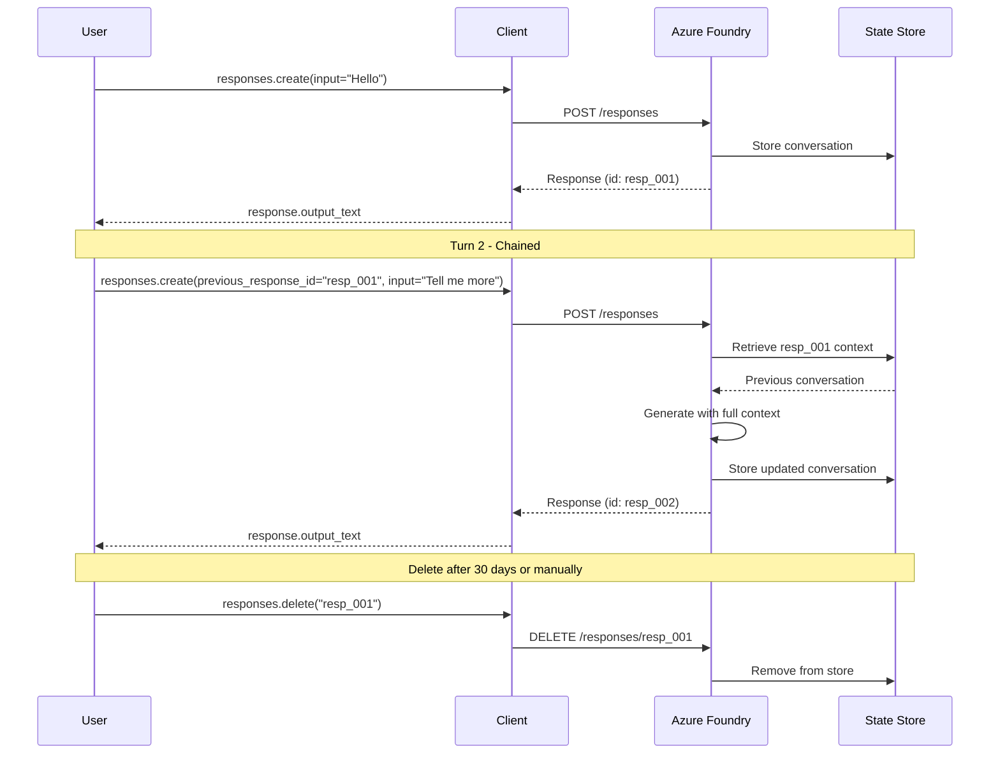
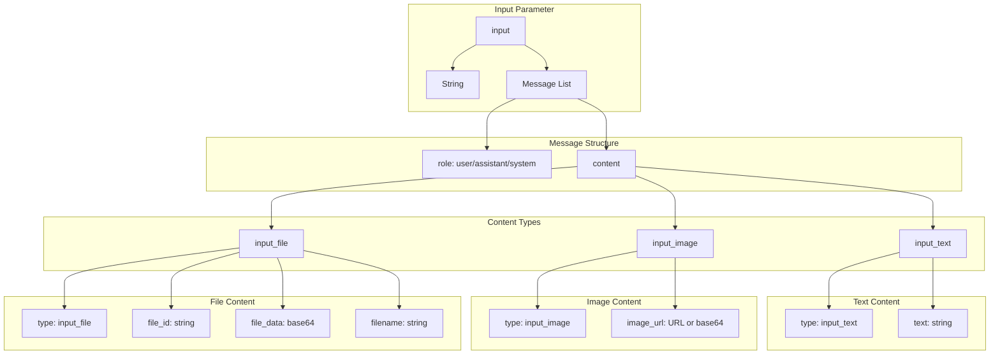
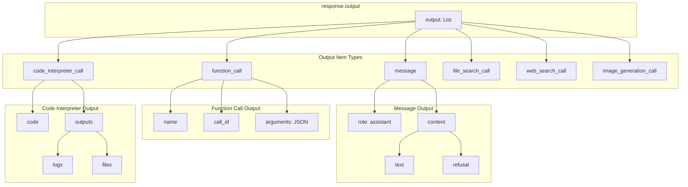
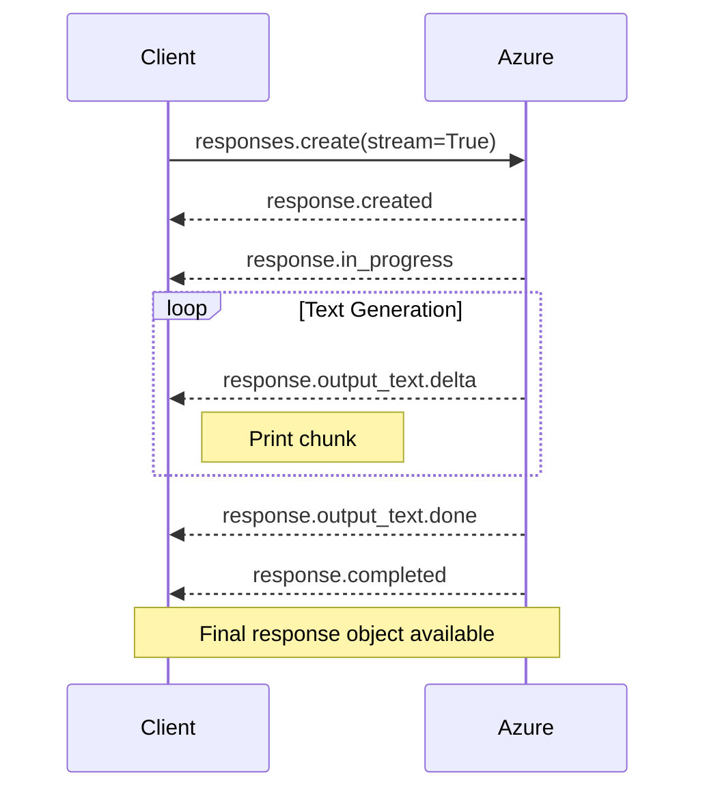
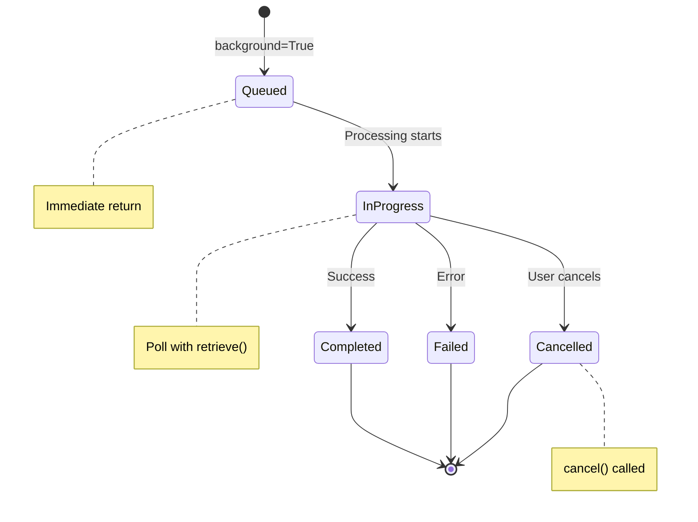
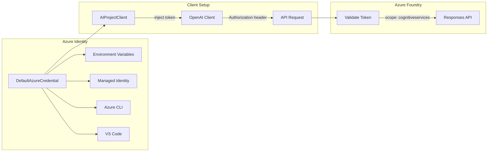
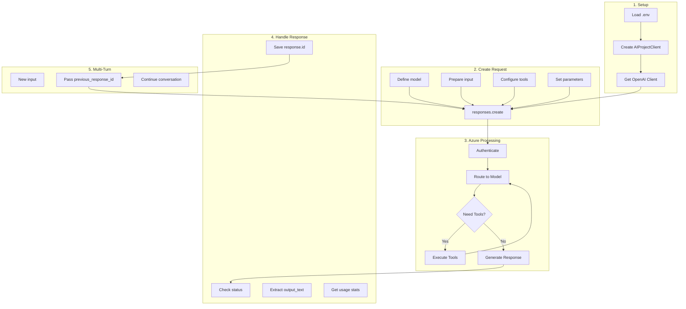

# Azure Responses API SDK - Architecture Diagrams

## 🏗️ SDK Class Hierarchy

## 🔄 Request Flow

## 🔧 Tool Types

## 🔗 Response Chaining (Multi-Turn)

## 📥 Input Structure

## 📤 Output Structure

## 🌊 Streaming Flow

## ⏳ Background Task Flow

## 🔐 Authentication Flow

## 📊 Complete Data Flow

