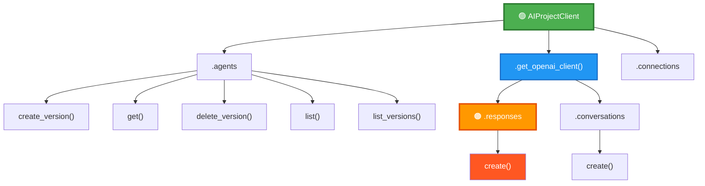
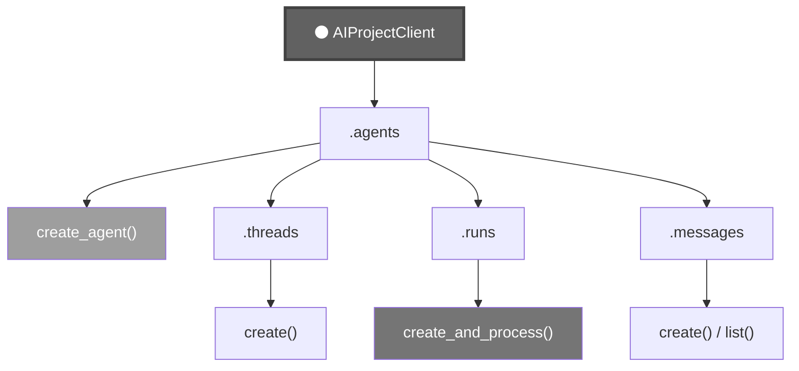
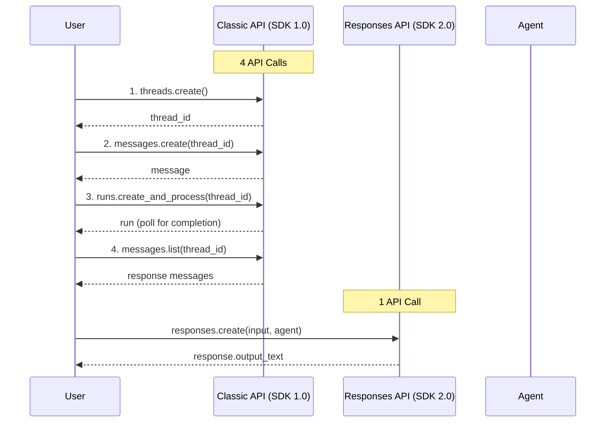
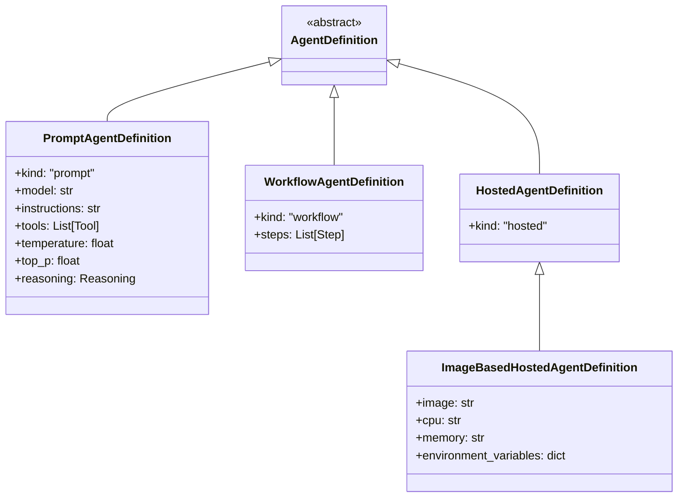
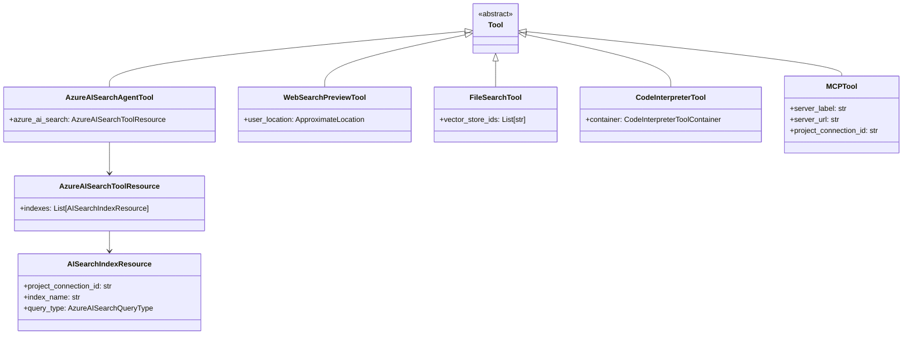
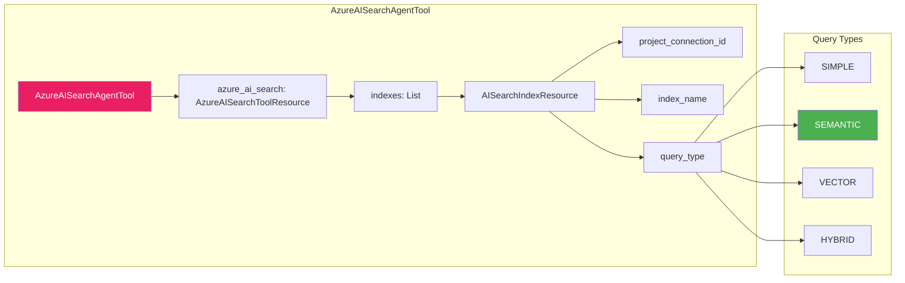
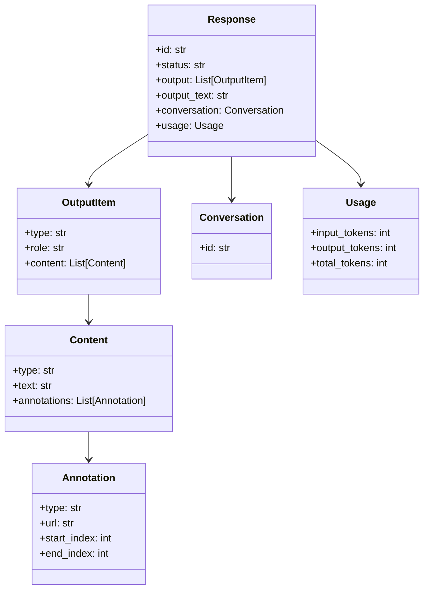
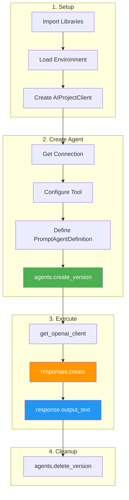

# Azure AI Agents - Responses API Schema

This document provides a visual reference for the new Azure AI Agents Responses API (SDK 2.0+).

## Quick Reference: Python Introspection Commands

Use these commands to explore any Python SDK:

```python
# 1. List all classes in a module
from azure.ai.projects import models
print([x for x in dir(models) if not x.startswith('_')])

# 2. Filter classes by name pattern
print([x for x in dir(models) if 'Agent' in x])

# 3. See attributes of a class
from azure.ai.projects.models import PromptAgentDefinition
print([x for x in dir(PromptAgentDefinition) if not x.startswith('_')])

# 4. Get docstring/help
print(PromptAgentDefinition.__doc__)

# 5. Get method signature
import inspect
print(inspect.signature(SomeClass.some_method))

# 6. See methods of a client
print([x for x in dir(client.agents) if not x.startswith('_')])
```

---

## API Architecture Overview

### SDK 2.0 - Responses API (New)



### SDK 1.0 - Classic API (Legacy)



---

## Classic vs Responses API Flow



---

## Agent Definition Types



---

## Tool Types Hierarchy



---

## Azure AI Search Tool Configuration



---

## Response Object Structure



---

## Complete Code Pattern



---

## Key Classes Reference

| Class | Purpose | Key Attributes |
|-------|---------|----------------|
| `AIProjectClient` | Main client for Azure AI Projects | `.agents`, `.connections`, `.get_openai_client()` |
| `PromptAgentDefinition` | Define a prompt-based agent | `model`, `instructions`, `tools`, `temperature` |
| `AzureAISearchAgentTool` | Azure AI Search tool wrapper | `azure_ai_search` |
| `AzureAISearchToolResource` | Search configuration | `indexes` |
| `AISearchIndexResource` | Index details | `project_connection_id`, `index_name`, `query_type` |
| `AgentReference` | Reference to an agent | `name`, `version`, `type` |

---

## API Versions Comparison

| Feature | SDK 1.0 (Classic) | SDK 2.0 (Responses) |
|---------|-------------------|---------------------|
| Package | `azure-ai-projects==1.0.0` | `azure-ai-projects>=2.0.0b1` |
| Agent Creation | `create_agent()` | `create_version()` |
| Agent Storage | Single instance | Versioned (`agent:1`, `agent:2`) |
| Conversations | `threads.create()` | `conversations.create()` |
| Execution | `runs.create_and_process()` | `responses.create()` |
| Polling | Required | Not needed (synchronous) |
| Output | `messages.list()` | `response.output_text` |
| Tool Definition | `AzureAISearchTool` | `AzureAISearchAgentTool` + `AzureAISearchToolResource` |

---

## Useful Resources

- **PyPI**: [azure-ai-projects](https://pypi.org/project/azure-ai-projects/)
- **GitHub SDK**: [azure-sdk-for-python](https://github.com/Azure/azure-sdk-for-python/tree/main/sdk/ai/azure-ai-projects)
- **API Reference**: [Azure AI Projects Python](https://learn.microsoft.com/en-us/python/api/overview/azure/ai-projects-readme)
- **Migration Guide**: [Upgrading to new agents](https://learn.microsoft.com/en-us/azure/ai-foundry/agents/how-to/migrate)

---

## Tools for Exploring APIs

| Tool | What It Does |
|------|--------------|
| `dir(object)` | List all attributes/methods |
| `help(object)` | Show documentation |
| `object.__doc__` | Get docstring |
| `inspect.signature(func)` | Get function signature |
| `type(object)` | Get the type/class |
| `isinstance(obj, Class)` | Check if object is instance |

### Example Exploration Session

```python
# Start exploring a new SDK
import azure.ai.projects as proj

# What's in this package?
print(dir(proj))

# What models are available?
from azure.ai.projects import models
all_models = [x for x in dir(models) if not x.startswith('_')]
print(f"Found {len(all_models)} models")

# Find agent-related models
agent_models = [x for x in all_models if 'Agent' in x]
print(agent_models)

# Explore a specific model
from azure.ai.projects.models import PromptAgentDefinition
print(PromptAgentDefinition.__doc__)
```
